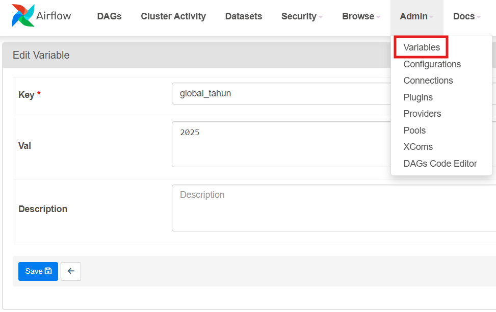

---
**This section contain how to parse argument or variable from airflow to spark (pyspark)**

There are only one prerequisite to run the program: setting Variables in airflow. If you don't want to do it, you can change `today_year` source using simple integer or string like "2025".

Here is how to setting Variables in airflow:

Figure 1

After we send the argument, receive the argument by look at this section: [Receive argument from Airflow in PySpark](https://github.com/MuhammadMukhlis220/Spark/tree/main/spark_parsing_from_airflow)
